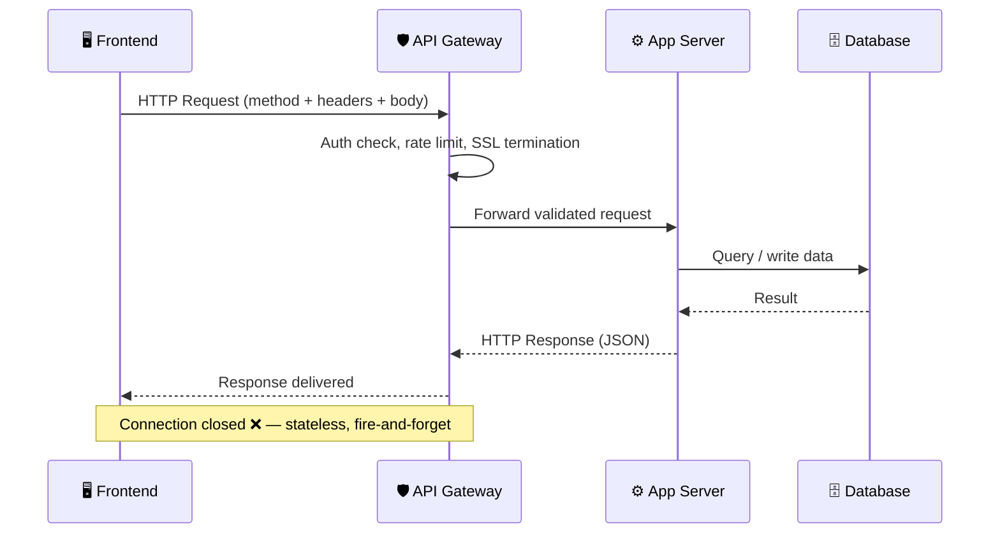
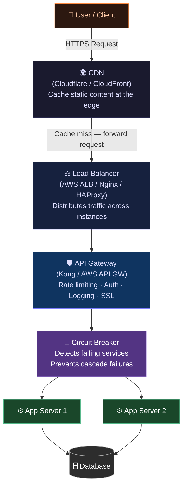
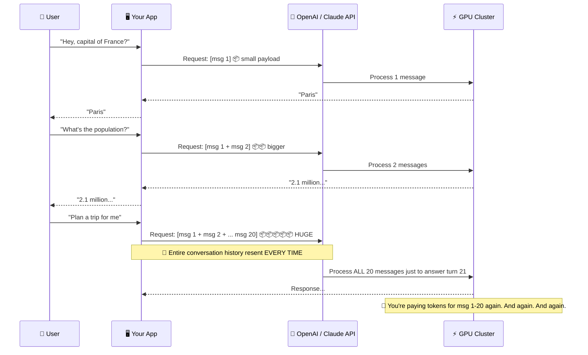
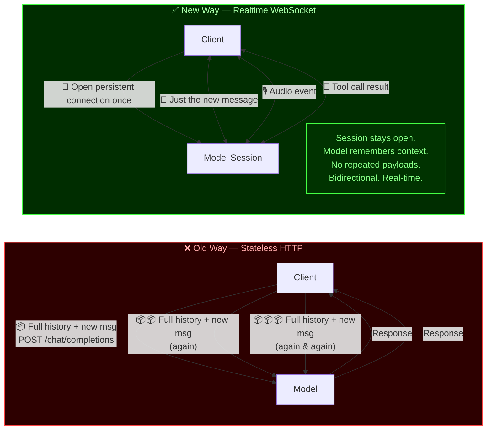

Let me say something that's going to upset a few senior developers out there:

**Most devs with 3+ years of experience still have no idea how networking actually works inside their own applications.**

I'm not being mean. I'm being honest. You can build a full SaaS, ship it to production, handle thousands of users — and still have zero mental model of what happens the moment your code fires off an `axios.post()` or a `fetch()`. You just trust the library, trust the API, trust the vibes, and pray the response comes back in under 500ms.

That ends today. We're going to talk about how an API call actually works, how traffic flows through your stack, and — the part most tutorials completely skip — how AI model APIs operate differently from everything else you've used. Then we're going to talk about why every chatbot you've built has a dirty little secret that's quietly burning your tokens and your users' patience. And finally, I'll tell you about a new standard that I think is genuinely exciting.

Buckle up.


## First, What Even Is an API Call?

Okay, basics — but the boring basics matter.

When your frontend makes an API call, here's what actually happens at the network level:

1. Your code constructs an **HTTP request** — a method (GET, POST, etc.), a URL, some headers, maybe a JSON body.
2. That request gets broken into **TCP packets** and routed across the internet through a chain of servers, load balancers, and infrastructure that you have never thought about for even one second.
3. The request hits your **API server** (maybe behind an Nginx reverse proxy, maybe behind an API gateway like Kong or AWS API Gateway). The server authenticates the request, validates it, and hands it off to your application logic.
4. Your app does its thing — hits a database, calls another service, computes something — and builds a **response**.
5. That response travels back across the same chain of infrastructure.
6. Your client receives it. Your `then()` block fires. Life is good.

Sounds simple. And for basic CRUD apps, it kind of is.



But here's where 90% of developers stop thinking about it. They treat the API like a magic function call. Hit endpoint, get data. Move on. They never think about:

- **What happens if the connection drops mid-request?**
- **What's inside the request payload — and how big is it?**
- **Who's managing the state of this conversation?**

That last one? That's where it gets spicy, especially when AI enters the picture.


## The Traffic Reality Nobody Talks About

Before we get to AI, let's talk about traffic management — because this is the layer most junior AND mid-level devs completely ignore.

When you have a production API, your requests don't just fly directly to your application server. They usually go through a few checkpoints:

**Load Balancers** distribute incoming traffic across multiple instances of your server. Without one, a traffic spike kills you. With one, you survive Black Friday. AWS ALB, Nginx, HAProxy — pick your poison.

**API Gateways** sit in front of everything and handle cross-cutting concerns: rate limiting, authentication, SSL termination, request logging, caching. Think of it as the bouncer at the club. No ticket? No entry. Too many requests? Slow down, buddy.

**CDNs** cache responses at edge locations closer to your users. Static content? Serve it from the edge, never hit your origin. Cloudflare, AWS CloudFront, Vercel's edge network — these shave hundreds of milliseconds off your response times.

**Circuit Breakers** detect when a downstream service is failing and stop routing traffic to it, preventing cascade failures. If your payment gateway is down, your circuit breaker should catch that before it takes down your whole checkout flow.

Most tutorials teach you how to build an API. Almost none of them teach you how to *operate* one. And the difference between those two things is the difference between a side project and a production system.




## Now, AI APIs — This Is Where It Gets Different

Okay. You've been making regular REST API calls. You sort of get it. Now someone tells you to integrate OpenAI or Anthropic's Claude into your app. How different could it be?

*Very* different. Let me explain.

With a normal REST API, you send a request and you get a response. The server is stateless — it doesn't remember your last call, doesn't care about your history, doesn't need to know anything beyond what you send in this request. Clean. Simple.

AI language models don't work that way. **They need context to be useful.**

When you send a message to GPT-4 or Claude, the model doesn't magically remember your last conversation. There's no persistent memory living in some server. The model is fundamentally stateless. So to make it *feel* stateful — to make it feel like it knows what you were just talking about — your application has to **manually send the entire conversation history** with every single request.

Every. Single. Request.

Think about what that means. You have a chatbot. A user starts a conversation. After 10 turns back and forth, your API request body looks something like this:

```json
{
  "model": "gpt-4",
  "messages": [
    { "role": "user", "content": "Hey, what's the capital of France?" },
    { "role": "assistant", "content": "The capital of France is Paris." },
    { "role": "user", "content": "What's the population?" },
    { "role": "assistant", "content": "Paris has a population of around 2.1 million..." },
    ...
    { "role": "user", "content": "Ok now I want to plan a trip there" }
  ]
}
```

This is called **the context window**. And it's both the superpower and the Achilles heel of every AI chatbot ever built.




## The Context Problem: Why Your Chatbot Is Eating Itself

Here's the dirty truth that nobody puts in their "Build a ChatGPT Clone in 30 Minutes" tutorial.

Every time your user sends a new message, you're not just sending that message. You're sending **the entire conversation** — all previous messages, all previous responses, everything — as one giant payload to the AI provider's endpoint. Then that endpoint forwards the whole thing to the GPU cluster, the model reads ALL of it to understand what's happening, and finally generates a response for the new message.

As the conversation gets longer, a few ugly things happen:

**1. Your payload gets enormous.** You're re-sending 20, 30, 50 message turns with every single request. That's a lot of data flying across the wire, over and over and over.

**2. Your latency creeps up.** The model has to process more tokens. More tokens = more compute = more time. That snappy first response? By message 40, it's not so snappy.

**3. Your costs go parabolic.** Most AI APIs charge per token. You're paying for the entire conversation history on every call. A 50-turn conversation with rich responses means you're billing the user's early messages *50 times* across the lifetime of that chat.

**4. You hit the context limit.** Models have a maximum context window. GPT-4 has 128k tokens, Claude has even more — but they're not infinite. When you blow past the limit, you have to start truncating or summarizing old messages. Now your bot starts "forgetting" things, and users get confused.

This model of passing full context on every request was essentially **standardized by OpenAI in 2023-2024**. Everyone in the industry adopted it. Every tutorial teaches it. Every chatbot you've used is probably built on it. And it works — don't get me wrong, it *works* — but it has fundamental efficiency problems baked into its architecture.

The connection that sent message number one is long gone by the time you're sending message number twenty. Each new message is a brand new HTTP connection, a brand new handshake, a brand new payload containing the full weight of the entire conversation. It's like calling a customer service rep, explaining your whole situation, getting an answer, *hanging up*, then calling back with the same full explanation just to ask one follow-up question. Every time.


## The New Thing I'm Actually Excited About: OpenAI Realtime WebSocket

This is where it gets interesting.

OpenAI has been pushing a new approach: [the Realtime API with WebSocket](https://developers.openai.com/api/docs/guides/realtime-websocket).

Instead of stateless HTTP request-response cycles, you open a **persistent WebSocket connection** between your app and the model. The connection stays open. The model maintains a live session. You send events down the pipe, get events back — all in real time, over a single persistent connection.

What does this change?

**No more re-sending the full context every turn.** The session is persistent. The model already knows what was said. You just send the new message.

**True streaming, not fake streaming.** With regular streaming (SSE over HTTP), you get tokens trickling in but you still sent the full payload. With WebSocket, it's a bidirectional real-time channel. You can send audio, receive audio, handle interruptions, manage tool calls — all without the overhead of re-establishing a connection.

**Lower latency for multi-turn conversations.** The roundtrip for each message is dramatically shorter when you're not re-building and transmitting a multi-kilobyte context payload every single time.

**Audio natively supported.** This isn't just for text. The Realtime API was designed with voice interactions in mind. Send audio in, get audio out, no intermediate transcription layer needed.

Is this going to replace the standard request-response pattern for every use case? No. For simple one-shot queries, regular API calls are totally fine. But for **live conversational agents, voice interfaces, multi-step agentic workflows** — this is genuinely a better architecture.



The industry is starting to shift. And if you're building anything that involves sustained multi-turn interaction with an AI model, you need to understand this pattern before your competitors do.


## So What Does This Mean for You, the Developer?

A few practical takeaways:

**Understand your payload.** Log your API requests in development. Actually look at how big that messages array is getting. You'll be surprised.

**Implement context management.** Don't naively append every message forever. Implement windowing — keep the last N turns, or summarize older context. Your costs and your latency will thank you.

**Use streaming.** Whether you're on HTTP SSE or WebSocket, don't wait for the full response before showing the user anything. Stream tokens as they arrive. The perceived performance difference is massive.

**Consider WebSocket for stateful agents.** If you're building something that's meant to have a long-running conversation — a voice assistant, a coding agent, a customer service bot — look seriously at the Realtime API. The per-request context overhead of HTTP might be the wrong model for your use case.

**Think about the infrastructure, not just the endpoint.** Rate limits, retry logic, fallback providers, token budgeting — these aren't optional nice-to-haves. They're what separates a toy from a product.


## The Bottom Line

APIs are not magic function calls. Networking is not an abstraction you can afford to ignore. And AI APIs are a fundamentally different beast from the REST endpoints you've been using to fetch user data or process payments.

The pattern that the entire industry standardized around — stateless HTTP with full context re-sent on every call — made perfect sense in 2023. It was a clean, understandable, universally supported approach. It got a million products shipped. But it has real costs at scale, real latency implications, and real architectural limits.

OpenAI's push toward WebSocket-based persistent sessions isn't just a performance optimization. It's a signal that the way we think about AI integration in applications needs to evolve. The model isn't a vending machine you hit with a coin and wait for candy. It's more like a collaborator — and persistent connections are a more honest reflection of what that actually means.

Learn how the network works. Think about your payloads. And keep an eye on where the standards are going.

Because the devs who understand this stuff aren't just building faster apps. They're building *fundamentally different* ones.

*References:*
- *OpenAI Realtime API with WebSocket: [https://developers.openai.com/api/docs/guides/realtime-websocket](https://developers.openai.com/api/docs/guides/realtime-websocket)*
- *OpenAI Realtime API Overview: [https://developers.openai.com/api/docs/guides/realtime](https://developers.openai.com/api/docs/guides/realtime)*
- *OpenAI Conversation State Guide: [https://developers.openai.com/api/docs/guides/conversation-state](https://developers.openai.com/api/docs/guides/conversation-state)*
