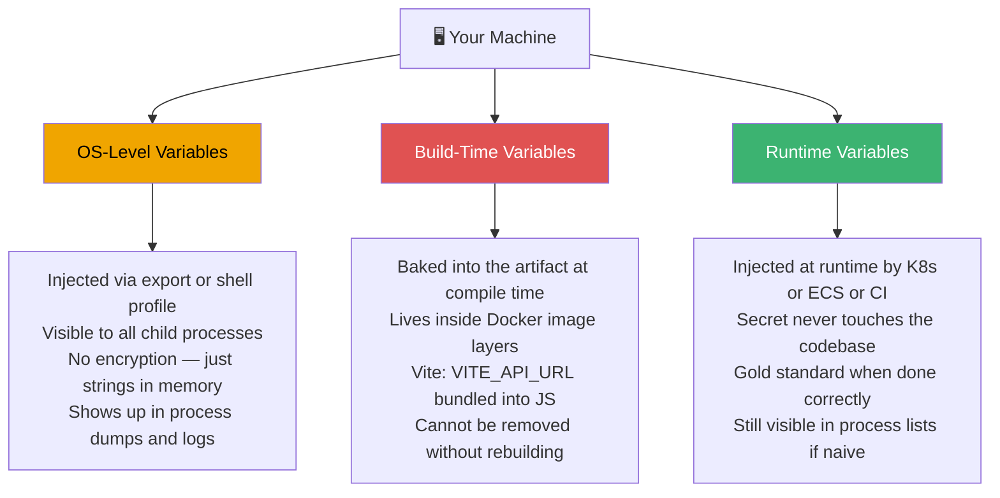
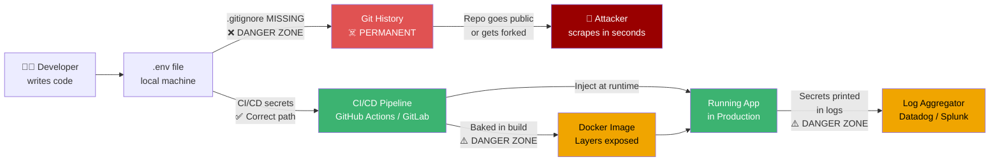
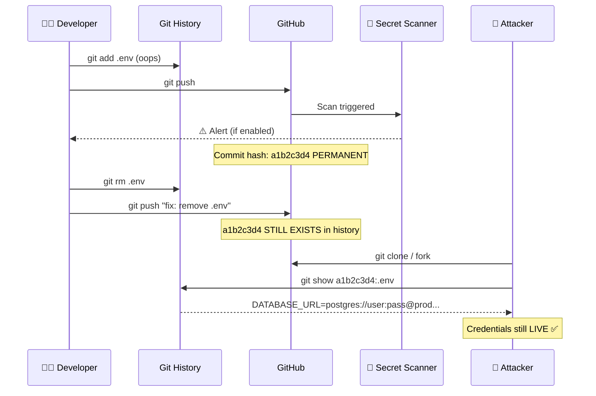
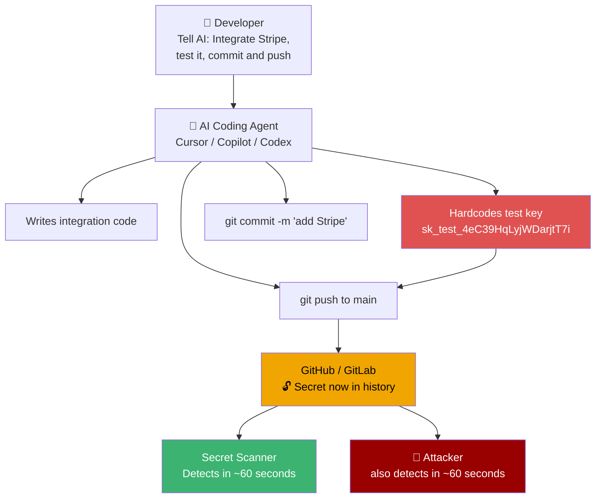
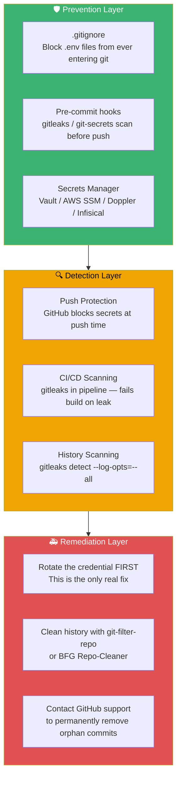
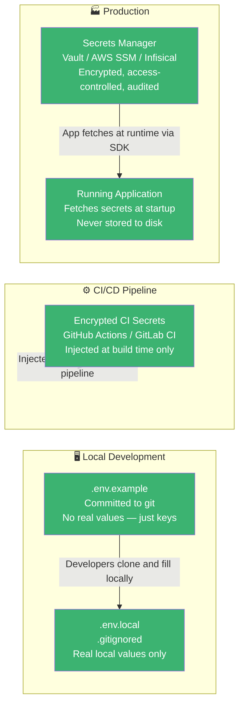
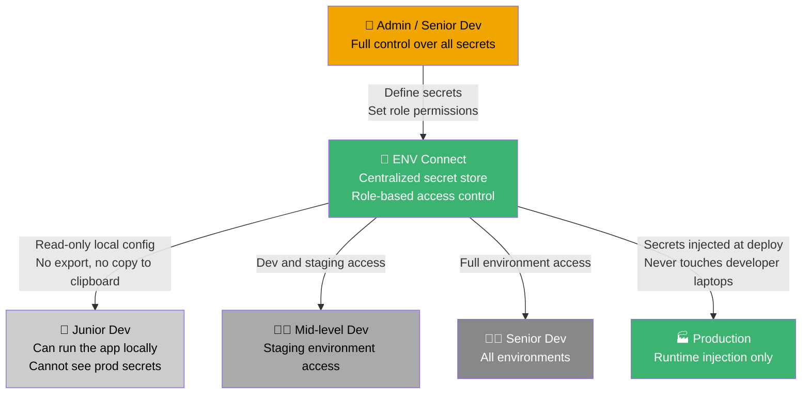

# The `.env` File That Could Kill Your Startup

Let me tell you something that happened on one of my teams.

A junior dev — talented, fast, genuinely excited about shipping — committed a `.env` file to a staging repo. It had API keys, database credentials, the whole configuration dump. Nobody caught it in the PR review. It sat there for a few days before someone noticed. We panicked, deleted the file, pushed a new commit, and thought: _"okay, it's gone."_

It was not gone.

Git never forgets. That's not a metaphor — it's literally how the tool works. The commit hash still existed. The history was still there. Anyone who cloned or forked the repo in that window had a full copy of the credentials. We were lucky nothing got exploited.

That incident is part of why I'm writing this post, and also part of why I started building **ENV Connect** — an internal tool to give teams the access they need without giving them the ability to accidentally commit what they shouldn't. More on that later.

But first, let's talk about the actual problem. Because "don't commit your `.env` file" is the beginner lesson, and most developers have heard it. The deeper problem is that environment variables are more complex than they look, the consequences of getting them wrong are more severe than most people realize, and in 2026, AI tooling is actively making the situation worse.

---

## First, Let's Talk About What an Environment Variable Actually Is

I know. You know what an env var is. But bear with me for a second, because the real problem isn't what they are — it's that most developers treat them as one flat category of thing. They're not.

Environment variables live at three distinct layers of your system, and those layers behave in fundamentally different ways.

**OS-level variables** are the ones your operating system knows about. When you type `export DATABASE_URL=postgres://...` in your terminal, you're injecting something into the shell's process environment. Every child process that spawns from that shell can read it. The operating system itself doesn't validate, encrypt, or protect this in any meaningful way — it's just a string in memory. Any process with enough privilege can inspect it, and it shows up in process dumps, logs, and system diagnostics.

**Build-time variables** are a different beast entirely. These are values baked into your application during compilation or bundling. Think `ARG` in a Dockerfile or `VITE_API_URL` in a Vite app. If you pass a secret as a build-time variable, it gets burned into the artifact itself — the Docker image layer, the JavaScript bundle, the compiled binary. You cannot "delete" it from the artifact later without rebuilding. Any layer in a Docker image that touched a secret can expose it through `docker history`. Multi-stage builds with BuildKit's secret mount feature exist specifically to solve this, but not enough people use them.

**Runtime variables** are what most people _think_ they're using. These are injected into your running application by your container orchestrator (Kubernetes, ECS, whatever), your CI/CD pipeline, or a secrets manager. Done right, this is the gold standard — the secret never lives in your codebase, never gets baked into an image layer, and only exists in memory for the duration of the process.

The gap between understanding _that_ these three layers exist and understanding _how_ to handle each one correctly is where most leaks happen.

---

## The Lifecycle of a Secret (and Where Things Go Wrong)

Here's the full journey a secret takes from your brain to production — and the danger zones at every step:

Notice how many paths lead somewhere dangerous. The "correct" path is actually a narrow corridor. Everything else is a potential leak surface.

---

## The Git History Problem Is Worse Than You Think

Here's the number that should scare you: in 2024 alone, GitHub detected over 39 million leaked secrets across its platform. Not "suspicious code." Not "potential issues." Verified secrets — API keys, tokens, credentials — with the number growing year over year.

And here's the part people miss: deleting a file doesn't delete the commit. Pushing a "fix" that removes the `.env` doesn't remove the `.env` from your history. Making the repository private after the fact doesn't help if anyone forked or cloned it before you flipped that switch.

Truffle Security researchers scanned GitHub's so-called "oops commits" — force-pushed or deleted commits that remain archived — and found thousands of still-active credentials. Not historical curiosities. Live, working, exploitable secrets that developers thought they'd cleaned up.

GitGuardian's 2025 State of Secrets Sprawl report found something even more uncomfortable: 70% of secrets leaked in 2022 are still active today. Developers rotate their keys when they remember to, or when they get an alert, or when something breaks. The rest just sit there. Waiting.

The average cost of a data breach in 2024 crossed $4.45 million — and a significant number of those breaches trace back to a single exposed credential that nobody thought to revoke.

Even OWASP says that environment variables themselves are not recommended for production secrets because they're accessible to all processes and tend to appear in logs and system dumps. Their actual guidance is in-memory shared volumes or dedicated secrets managers. Most teams aren't there yet.

Private repositories aren't a safe harbor either. GitGuardian found that 35% of customers' private repositories contain plaintext secrets. AWS IAM keys appear 5× more frequently in private repos than public ones — people think the privacy label means they can relax. They can't.

---

## The AI Agentic Workflow Problem

This is the part that actually worries me right now.

For years, the env-leak problem was caused by human forgetfulness. "We were moving fast." "We forgot `.env` wasn't in `.gitignore`." "We'll clean it up later." Understandable. Fixable with better habits and tooling.

Now we have a new vector: AI agents that can write code _and_ commit it.

GitGuardian found that repositories where GitHub Copilot is active have a 40% higher secret leak rate than repositories without it. The tool that's supposed to make you more productive is statistically correlated with more security incidents. Why? Because AI coding assistants write code fast, they follow patterns from training data (which includes bad patterns), and they have no concept of what a secret _means_ or what happens when one gets exposed.

You tell your agentic workflow: "Integrate Stripe, test it, commit, and push." The agent writes the integration, hardcodes the test key, writes the commit message, and pushes. It's not malicious. It doesn't understand the difference between a string literal and a credential. It's just doing what you asked.

Wiz scanned the Forbes AI 50 companies — the cream of the AI startup crop — and found that 65% of them had leaked verified secrets on GitHub. These are well-funded, technically sophisticated teams. The most common sources: `.env` files, Python scripts, and Jupyter notebooks.

One leaked Hugging Face token belonging to an AI 50 company exposed access to roughly 1,000 private models. Someone with that token could download or inspect proprietary training data and model weights. That's not an inconvenience — that's an existential IP risk.

---

## What the Industry Has Built to Solve This

The good news is that the tooling landscape is genuinely mature now. The bad news is that most teams are using only a fraction of it.

**Pre-commit scanning** is your first line of defense. Tools like `gitleaks` and `git-secrets` run locally before a commit ever reaches the remote. They scan for patterns matching known secret formats — AWS keys, Stripe tokens, database URLs — and block the push if they find something. If your team isn't running pre-commit hooks that scan for secrets, you're relying entirely on humans to not make mistakes. That's not a security model.

**Push protection** at the platform level is now on by default for public GitHub repositories. GitHub has a partnership program with hundreds of token issuers — AWS, Google Cloud, OpenAI, Meta — where detected secrets trigger immediate notification to the issuer, who can then revoke the credential. This is genuinely impressive infrastructure. It's also a last resort, not a first defense.

**Secrets managers** — AWS Secrets Manager, HashiCorp Vault, GCP Secret Manager, Azure Key Vault, Doppler, Infisical — are the production-grade answer. Instead of putting your database password in an env var, you put the _path to the secret_ in an env var, and your application fetches the actual value at runtime from the secrets manager. The secret never lives in your codebase, your Dockerfile, or your CI/CD config.

---

## The Right Architecture: How It Should Actually Look

This is the pattern that separates teams that sleep well from teams that get Slack messages at 2 AM:

The principle is simple: **your codebase should only ever contain references to secrets, never the secrets themselves.** Your `.env.example` should be committed (with placeholder values). Your real `.env` should never be committed, ever, under any circumstances.

---

## The Tooling Stack I'd Actually Recommend

If you're building something real, here's what I'd put in place:

1. **`.gitignore` first, forever.** `.env`, `.env.local`, `.env.production`, `*.pem`, `*.key` — all of it. Before you write a single line of code in a new project. Not after.

2. **Pre-commit hooks with `gitleaks`.** One command to install, catches most patterns automatically. Add it to your onboarding docs and make it non-optional for the whole team.

3. **`git-filter-repo` if you've already leaked something.** After you've cleaned history, rotate the credential regardless — cleaning history doesn't guarantee the secret wasn't already harvested.

4. **A secrets manager for anything that matters.** HashiCorp Vault if you want self-hosted and maximum control. AWS Secrets Manager if you're on AWS already. Doppler or Infisical if you want something with a nicer developer experience. Your application fetches the secret dynamically at runtime, not at build time, not from a file.

5. **CI/CD secrets injection, not dotenv files.** GitHub Actions has encrypted secrets. GitLab has CI/CD variables. Use them. Your production credentials should never exist in a file that touches a developer's laptop.

6. **Repository history scanning.** Run `gitleaks detect --source . --log-opts="--all"` on every branch. You might find things you'd rather know about before someone else does.

---

## What I'm Building: ENV Connect

This whole situation — the junior dev incident, the constant cycle of "someone committed what?" — is what pushed me to start building something internally called **ENV Connect** (the name will probably change, but the idea is solid).

The core problem I keep running into: I need to give developers access to the environment variables they need without giving them the ability to export those variables, copy them into code, or accidentally commit them. I want permission-based access — a junior dev gets the config they need to run the app locally, but they can't see the production Stripe secret key. I want it to be the path of least resistance, because if the secure option is harder than just creating a `.env` file, developers will create the `.env` file.

It's an early prototype. But the direction feels right: treat secrets as a separate concern from both the codebase and the developer's local machine.

---

## The Uncomfortable Reality

Here's what I keep coming back to: this problem isn't going away, and AI tooling is making it worse before it gets better.

We're in an era where AI agents can commit and push code autonomously. Where "vibe coding" is a legitimate workflow at funded startups. Where a non-technical founder can spin up a full application using natural language prompts and have it deployed to production in an afternoon — without ever thinking about whether their Stripe webhook secret just ended up in a public repository.

The industry has known about this problem since at least 2017, when TruffleHog was first published. Awareness has not eliminated it. The number of leaked secrets has gone up every single year. The reason is structural: the incentives reward shipping fast, and the consequences of leaked credentials are delayed and often invisible until they're catastrophic.

If you're raising real money, building a real product, handling real user data — this is not a "we'll clean it up later" item. A single leaked AWS key can be picked up by an automated scanner within minutes of hitting a public repo. The scanners never sleep. The cleanup is never simple. And the git history never forgets.

The `.env` file is not configuration. It's a target. Treat it like one.

---

_Building something in the secrets management space? Dealing with this exact problem on your team? Find me on Twitter or GitHub — always happy to talk shop._
