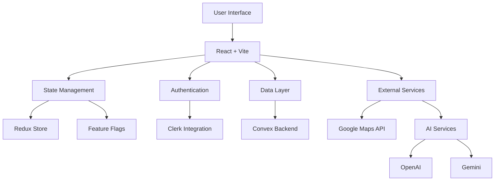

import ImageSlider from "../../components/ReactComponent/blog/enhancements/image-slider/image-slider";

## Project Overview

Lead Finder is a sophisticated SaaS platform designed to revolutionize how professionals discover and connect with business leads. Built with modern web technologies, it offers a seamless one-tab solution for finding, managing, and reaching out to potential business contacts.

## Key Features

- **Automated Lead Discovery**: Intelligent scraping and aggregation of business leads from various sources
- **AI-Powered Communication**: Integrated with Gemini & OpenAI for smart email generation
- **Gmail Integration**: Direct email communication within the platform
- **Lead Management**: Full CRUD operations for leads and email communications
- **Data Export**: Export leads to Excel/CSV format
- **Dark/Light Mode**: Customizable UI with multiple accent colors
- **Tiered Access**: Free and Pro ($8/month) subscription plans

## Technical Implementation

### Architecture Highlights

- **Frontend**: Built with React + Vite for optimal performance and development experience
- **Styling**: Tailwind CSS + Shadcn UI for a modern, responsive design
- **Authentication**: Secure user management through Clerk
- **Backend**: Scalable data management with Convex
- **State Management**: Redux for predictable state updates
- **Deployment**: Hosted on Vercel for reliable performance

## User Interface

<ImageSlider
  images={[
    "https://utfs.io/f/TViMykBJnLIJhuQmFqZi0dDZYrmVAUW9QOFM18RaCLso2Eyb",
    "https://utfs.io/f/TViMykBJnLIJ0VpHYpUyjPi0LTu2YFIrUpwecAbsgvfR1zoN",
    "https://utfs.io/f/TViMykBJnLIJYnr3G8MBpumy7J2TkiHEr1zoCSvZaef4URwI",
    "https://utfs.io/f/TViMykBJnLIJbCj9Sb4nRBrPQNqFmsSdU0jLhDYMVTkJ4Z76",
    "https://utfs.io/f/TViMykBJnLIJNqaAzNci8L7tVGxkecjRQf65gBKA0FPvhroa",
    "https://utfs.io/f/TViMykBJnLIJ8i2cXdtmYFqJTthG6XHUrp5nyDRAkMsBZ4v3",
    "https://utfs.io/f/TViMykBJnLIJi5o87ym04c8pb2PCWMuNRxzyw39BeGHY1I7F",
    "https://utfs.io/f/TViMykBJnLIJlmFgdnOwnMSaAmJh8r0o2yIjlPqUTZEsuO7H",
    "https://utfs.io/f/TViMykBJnLIJn5N7AFIMZG7ue52pCHBh13zVjoUnaQK4Nkm9",
    "https://utfs.io/f/TViMykBJnLIJAlkYMr61Mg4iar5NeWwFOBcTDdfUS0H7GbJP",
    "https://utfs.io/f/TViMykBJnLIJPfalGNLsLrZugTCMA8pqE2aJXReGfHYn6wI5",
    "https://utfs.io/f/TViMykBJnLIJhTUQB8Zi0dDZYrmVAUW9QOFM18RaCLso2Eyb",
    "https://utfs.io/f/TViMykBJnLIJ0qESVSUyjPi0LTu2YFIrUpwecAbsgvfR1zoN",
  ]}
  client:load
  layout="modern"
/>

## Future Development

The project roadmap includes:

1. **Enhanced Lead Sources**:
   - LinkedIn integration
   - Facebook lead lookup
   - Google search results scraping

2. **Platform Improvements**:
   - Expanded admin dashboard
   - Additional AI models and prompts
   - Comprehensive logging system

3. **Infrastructure**:
   - Codebase optimization
   - Enhanced documentation
   - Monitoring and error handling improvements

## Technical Challenges

One of the main challenges was balancing API costs with functionality:

- Managing Google Maps API usage
- Optimizing AI service calls (OpenAI + Gemini)
- Implementing efficient data caching
- Handling cross-environment data migrations

Despite starting as a simple one-page application, Lead Finder evolved into a full-featured SaaS platform with over 20,000 lines of TypeScript/JavaScript code, demonstrating the power of iterative development and careful architectural decisions.
